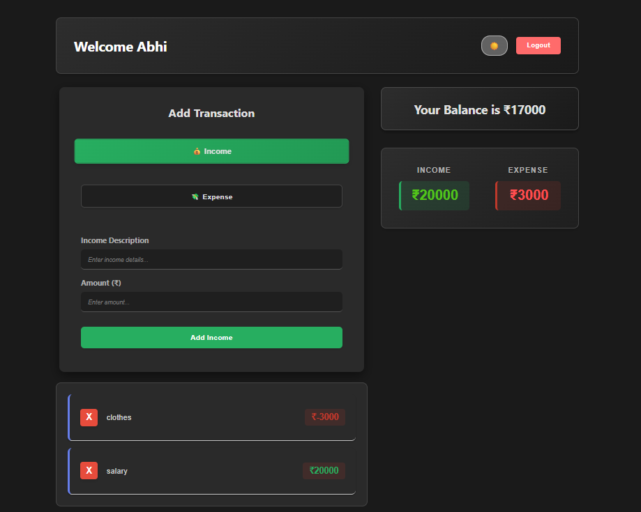
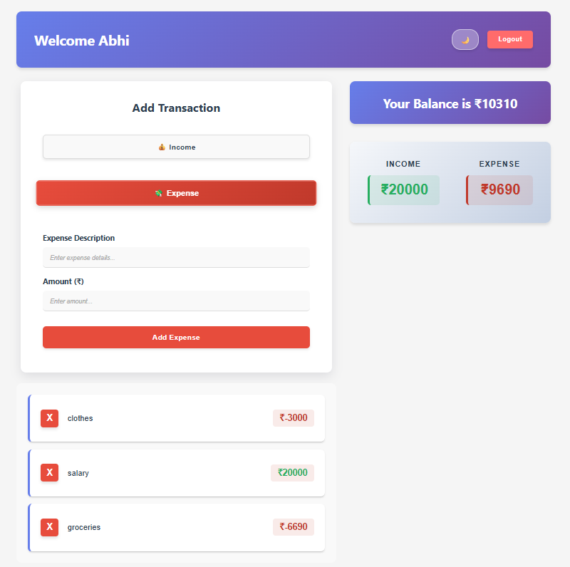
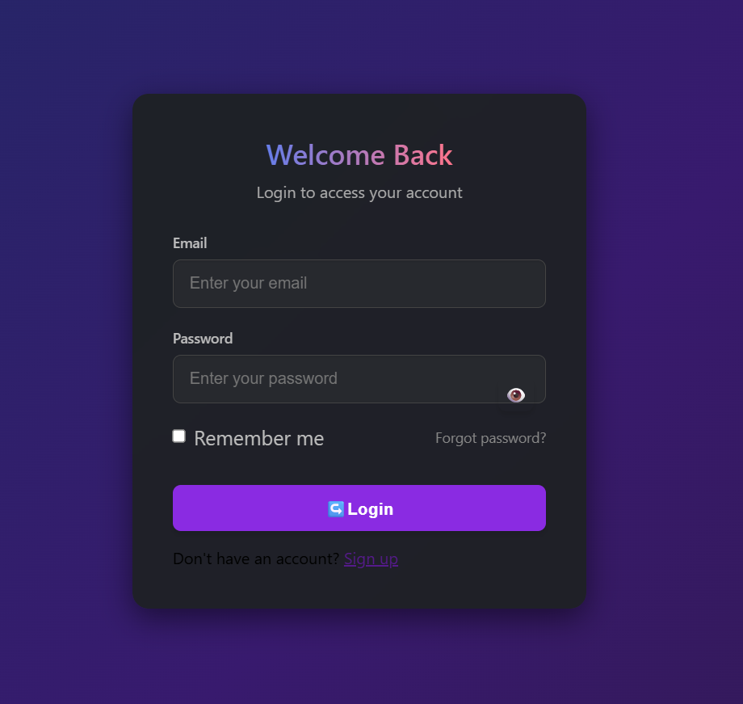
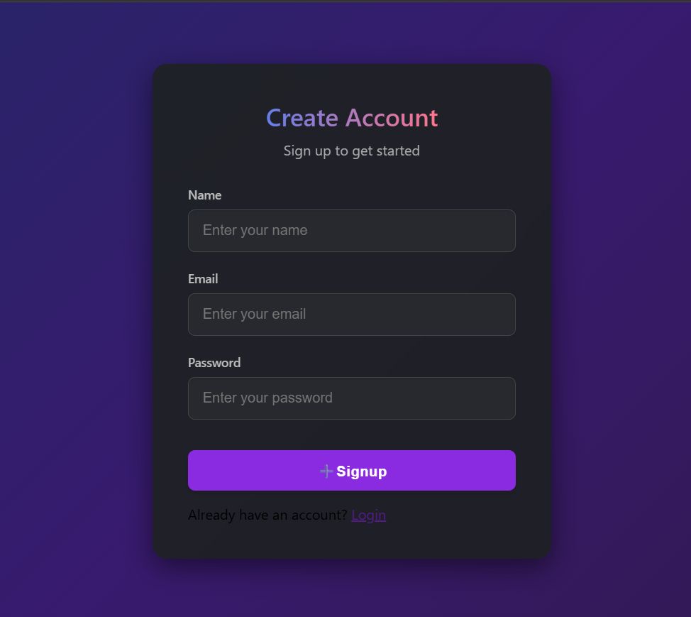

# MERN Expense Tracker

Small, focused MERN-stack expense tracker with authentication, transaction tracking, and a simple dashboard.

## Quick Start

1. Backend

```bash
cd backend
npm install
cp .env.example .env   # set MONGO_CONN and JWT_SECRET
npm run dev
```

2. Frontend

```bash
cd frontend
npm install
npm start
```

Visit `http://localhost:3000` for the client and `http://localhost:8080` for the API.

## Tech Stack

### Frontend

- React 18 for the UI layer
- React Router for page navigation
- React Toastify for in-app notifications
- React Scripts for the development and build toolchain
- Testing Library and Jest DOM for component testing

### Backend

- Node.js and Express 5 for the API server
- MongoDB with Mongoose for data storage and modeling
- JWT for authentication and protected routes
- bcrypt for password hashing
- Joi for request validation
- dotenv for environment configuration
- cors and body-parser for API middleware support

### Project Setup

- Vercel configuration is included for deployment support
- Nodemon is used during backend development for auto-reload
- The app follows a classic MERN flow: React client, Express API, MongoDB database

## Screenshots & Sample Data

The UI screenshots live in `frontend/public/screenshots/`.

- Home dashboard: [frontend/public/screenshots/homedark.png](frontend/public/screenshots/homedark.png)
- Home dashboard, light theme: [frontend/public/screenshots/homelight.png](frontend/public/screenshots/homelight.png)
- Login: [frontend/public/screenshots/login.png](frontend/public/screenshots/login.png)
- Register: [frontend/public/screenshots/register.png](frontend/public/screenshots/register.png)

Sample data can be added under `backend/sample-data/` if needed.






If you want, I can add a `backend/sample-data/transactions.json` example file.

## Contributing

1. Fork
2. Create branch
3. Make changes
4. Open PR

## License

MIT — see `LICENSE`.
